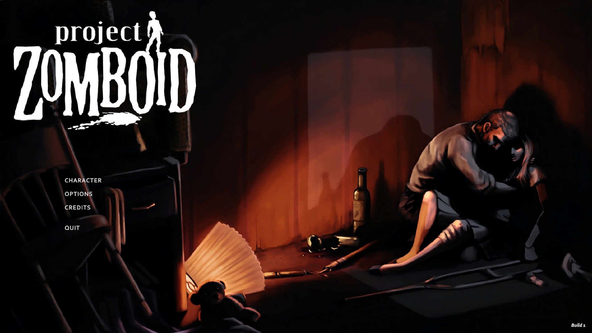
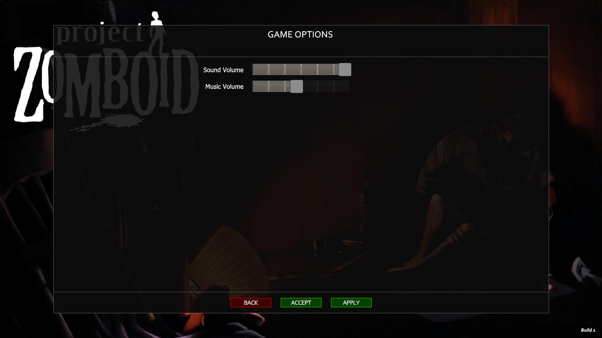
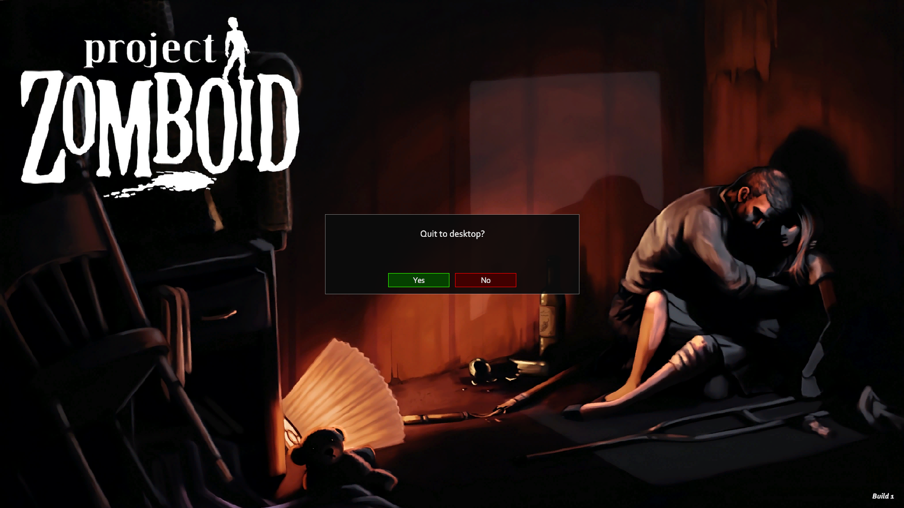
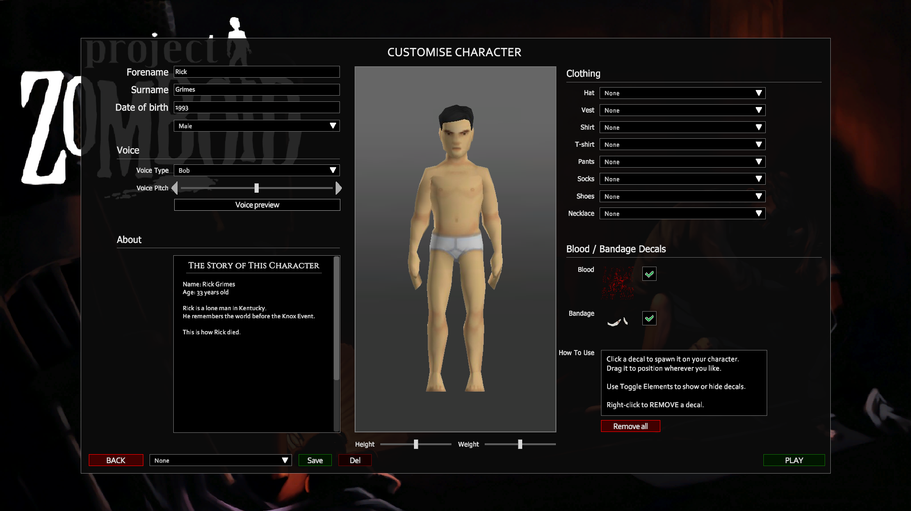
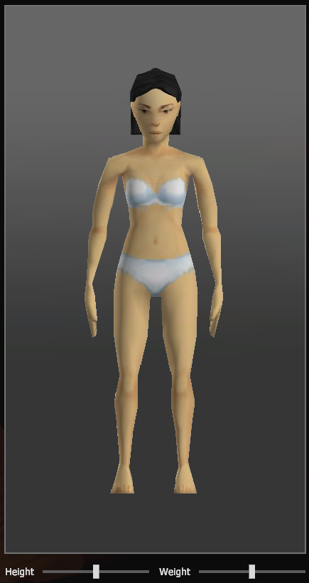
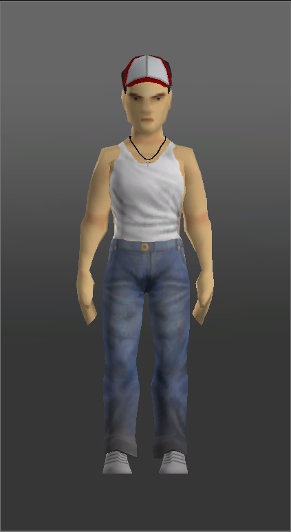
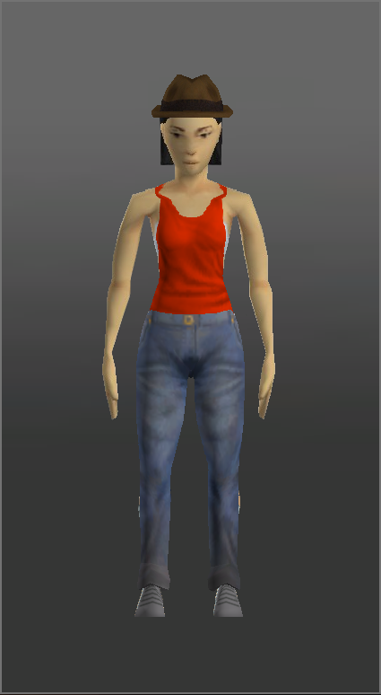

# Project Zomboid Tēlu Izveides Spēle (Smirnovs_UnityUI)

Interaktīva tēla izveides spēle, izstrādāta ar Unity un iedvesmota no **Project Zomboid**.

Šī spēle ļauj spēlētājiem definēt sava tēla identitāti un apģērbt to kā vēlās.

Šis projekts ir veidots pēc nosacītajām prasībām.

## Projekta prasības
Izstrādāt sākuma ainu, kurā ir iespējams aizvērt projektu vai izvēlēties uzsākt tēla veidošanas spēli. Nodrošināta iespēja pārslēgties starp projektā iekļautajām ainām (2p)

Pielietojot teksta ievades laukus (2 gab., input field) iespējams ievadīt tēla vārdu un dzimšanas gadu (šajā laukā iespējams ievadīt tikai skaitļus). Pogas (button) nospiešana nodrošina ievadīto vērtību attēlošanu teksta (text) laukā, aprēķinot vecumu.
(Piemēram: „Supervaronis Oskars ir 25 gadus vecs!”) (2p)

Pielietojot izkrītošo sarakstu (dropdown), iespējams izvēlēties vismaz divus tēlus, kurus iespējams apģērbt (1p)

Izveidotas vairākas apģērbu un aprīkojuma kategorijas (bikses, zābaki, cepures, cimdi, amuleti u.tml.), no kurām ar toggle pogu palīdzību iespējams parādīt un paslēpt attiecīgos elementus.
Katrā kategorijā satur vismaz trīs apģērba gabalus (2p)

Izvēlēto aprīkojumu pēc drag and drop principa ar datorpeles palīdzību ir iespējams pārvietot un nolikt izvēlētajā vietā uz tēla (1p)

Nodrošināti skaņas efekti (pogu klikšķi, fona mūzika, tēlu izdarītās skaņas) (1p)

Ainā ir ievietots scroll view, kurā lasāms apraksts par projektā iekļautajiem tēliem. Nomainot tēlu, attiecīgi nomainās arī tajā esošais tēla apraksts (1p)

Iekļauti divi slider elementi, kur viens maina apģērbjamā tēla garumu, bet otrs platumu (2p)

Projekta izstrādes process tiek izsekojams versijās ar Git versiju kontroles sistēmu, GitHub izvietots projektam aprakstošs README fails (2p)

Projekts ir izstrādāts noteiktajā termiņā, tā izstrāde ir veikta rūpīgi un tas ir darbināms bez funkcionālām nepilnībām (2p)

---
<h2 align="left">Ekrānšāviņi</h2>

<h3 align="center">Galvenā izvēlne un iestatījumi</h3>

| Galvenā izvēlne | Iestatījumi | Iziešanas logs |
| :---: | :---: | :---: |
|  |  |  |

<h3 align="center">Tēla izveides aina</h3>

<h3 align="center">Tēla skats</h3>

| Tēla priekšskatījums | Tēls vīrietis | Tēls sieviete |
| :---: | :---: | :---: |
|  |  |  |

> **Piezīme:** Visi apģērbu asseti ir pieejami docs mapē.

---

## Papildu Funkcijas

### Brūču un uzlīmju (Decal)

- **Velc un nomet brūces:** Velc asins šļakatas un pārsējus tieši uz tēla.
- **Pārvietojamas uzlīmes:** Pēc novietošanas uzlīmes var pārvietot vai noņemt ar labo peles klikšķi.

### UI Dizains

- **UI:** Ir iegūldīts laiks priekš ši projekta UI dizaina.
---

## Autori un pateicības
* **Iedvesma:** The Indie Stone (Project Zomboid)
* **Projekta Autors:** Emīls Smirnovs 2PT
